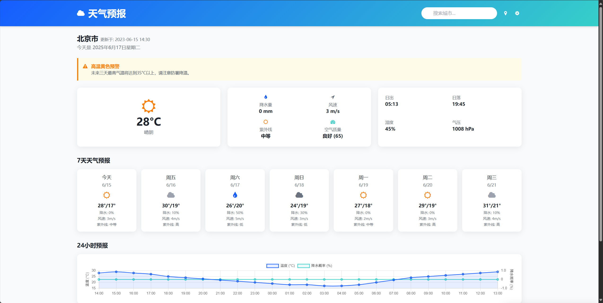
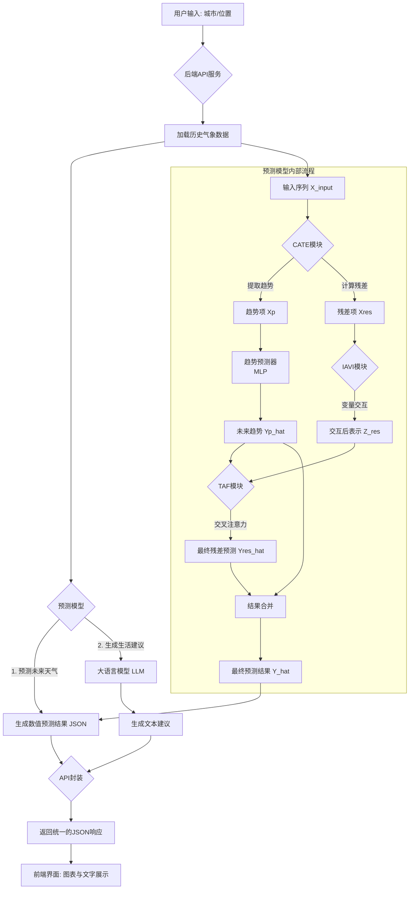

# 智能天气预测与服务系统

## 1. 项目概述



### 1.1 项目背景与动机

本项目旨在开发一款轻量化、智能化、场景化的天气预测与服务软件。其核心动因源于对当前主流气象服务存在的以下核心痛点的深度洞察：

* [cite_start]**技术瓶颈**：传统天气预测主要依赖于大型数值天气预报（NWP）模型 ，这些模型通过求解复杂的流体力学和热力学偏微分方程组进行预测，通常需要在超级计算机上运行数小时。这种高昂的计算成本和时间延迟，导致天气信息更新缓慢，且难以部署在移动端或边缘设备上，严重限制了其在实时应用场景中的价值。
* **体验鸿沟**：市面上的天气应用普遍存在“数据过载而价值不足”的问题。它们倾向于直接展示大量专业气象参数（如气压、湿度、等压线图等），但缺乏与用户日常生活的有机整合。用户需要自行解读数据，操作流程繁琐，难以快速获取真正有价值的行动指导。
* **服务脱节**：现有的气象服务大多是“一刀切”的通用模式，未能充分考虑不同用户群体（如通勤者、旅行者、户外运动爱好者）的差异化需求。天气预警与用户的日程管理、生活习惯脱节，难以形成真正有价值的服务闭环。

本项目旨在通过引入先进的AI技术，解决上述问题，打造一款**响应快速、理解用户、服务生活**的新一代天气应用。

### 1.2 项目解决的实际问题

本项目直接解决了以下几个实际问题：

1.  **预测效率问题**：通过构建轻量化的深度学习预测模型，将原先需要数小时的预测过程缩短至分钟级，实现了天气预报的近实时更新。
2.  **信息理解问题**：结合大语言模型（LLM），将复杂的数值预测结果自动转化为通俗易懂、个性化的生活建议和出行提醒，弥合了专业数据与用户理解之间的鸿沟。
3.  **服务个性化问题**：通过提供场景化的生活指数和智能推荐，使天气服务能更好地融入用户的日常生活决策中，提升了服务的实用性和附加值。
4.  **部署和使用门槛问题**：基于FastAPI的模块化设计和跨平台部署能力，使得整套系统易于集成和使用，降低了技术门槛。

## 2. 背景技术与方法分类

解决多变量时间序列预测（Multivariate Time Series Forecasting, MTSF）问题的主流方法大致可以分为以下几类：

* **传统统计学方法**：如ARIMA、VAR等模型，在处理线性和平稳序列时表现良好，但难以捕捉复杂的非线性关系。
* **经典机器学习方法**：如SVR、XGBoost等，能够处理非线性问题，但对时间序列的动态依赖关系建模能力有限。
* **基于深度学习的方法**：这是当前最前沿和最主流的方向，主要包括：
    * [cite_start]**RNN及其变体 (LSTM, GRU)**：擅长捕捉序列的短期和长期依赖，但存在梯度消失和并行计算能力差的问题 。
    * [cite_start]**CNN 기반 모델**：通过卷积核提取时间维度上的局部模式 。
    * [cite_start]**Transformer 기반 모델**：利用自注意力机制捕捉全局依赖关系，在许多序列任务中取得了突破性进展 [cite: 33][cite_start]。近年来，为了更好地处理时间序列的特性，又衍生出多种变体，如Informer [cite: 238][cite_start]、Autoformer [cite: 229][cite_start]、PatchTST 等。

[cite_start]其中，**时间序列分解（Time Series Decomposition）**被证明是一种非常有效的策略 [cite: 15, 195][cite_start]。它将复杂的原始序列分解为趋势项（Trend）、季节项（Seasonality）和残差项（Residual） [cite: 16][cite_start]，从而简化建模难度。Autoformer [cite: 18][cite_start]、DLinear [cite: 8][cite_start]、MICN [cite: 7][cite_start]、Leddam  等众多先进模型都采纳了这一思想。

[cite_start]**本项目的方法属于基于深度学习的、采用时间序列分解策略的Transformer改进模型**。与传统分解方法不同，我们没有使用固定的移动平均（Moving Average）来提取趋势 ，而是设计了一套创新的、可学习的分解与交互框架，以应对现有方法的局限性。

## 3. 本项目方法详解

我们的方法框架如下图所示，主要由三大创新模块构成：**复杂度感知的趋势提取 (Complexity-Aware Trend Extraction, CATE)**、**信息感知的变量交互 (Information-Aware Variable Interaction, IAVI)** 和 **趋势感知的预测 (Trend-Aware Forecasting, TAF)**。


### 3.1 核心流程

#### 整体工作流程图


### 3.2 核心模块与算法


#### 3.2.1 复杂度感知的趋势提取 (CATE)

[cite_start]**动机**：传统的移动平均方法是一种固定的平滑操作 [cite: 51][cite_start]，当原始数据含有大量噪声时，提取出的趋势可能会被污染，变得不平滑且难以预测 。我们的目标是提取出更平滑、更具可预测性的趋势。

**方法**：
1.  [cite_start]**可学习的分解**：我们使用一个**1D卷积层**来代替移动平均，通过学习卷积核的参数，自适应地从输入序列 $X_{input}$ 中提取趋势项 $X_p$ [cite: 61, 63][cite_start]。残差项 $X_{res}$ 通过相减得到 。
    $$
    X_p = \text{Conv1d}(\text{Padding}(X_{input})) \\
    X_{res} = X_{input} - X_p 
    $$
    
2.  **分解熵损失 (Decomposition Entropy Loss)**：为了引导模型生成更平滑（复杂度更低）的趋势，我们引入了基于**近似熵 (Approximate Entropy, ApEn)**  的损失函数 $\mathcal{L}_{DeEn}$ 。ApEn值越低，代表序列的规律性越强，可预测性越高 。我们通过最小化该损失，来约束1D卷积提取出的趋势 $X_p$ 的复杂度要低于（或接近）传统移动平均提取的趋势 $X_{trend}$ 。

    由于标准ApEn计算中的比较操作不可导 ，我们使用Sigmoid函数进行平滑近似 。最终的分解熵损失定义为：
    $$
    \mathcal{L}_{DeEn} = \frac{1}{C}\sum_{i=1}^{C} \left( \xi\Phi^{MA}(X_{trend}^{i}) - \Phi^{P}(X_{p}^{i}) \right)
    $$
    其中，$\Phi$ 是从ApEn推导出的复杂度衡量指标 ，$\xi$ 是一个平衡系数 ($0 < \xi < 1$)。

#### 3.2.2 信息感知的变量交互 (IAVI)

[cite_start]**动机**：在多变量场景下，不同变量（如温度、湿度）之间存在复杂的相互影响。直接使用注意力机制对所有变量进行交互，可能会引入比有用信号更多的噪声和干扰 。我们的目标是在捕捉有效依赖的同时，抑制无关信息的干扰。

**方法**：
1.  [cite_start]**变量级注意力**：我们将每个变量的残差序列 $X^c_{res}$ 作为一个令牌（Token），应用**变量级注意力机制（Variable-wise Attention）**来建模变量间的相互关系，生成交互后的表示 $Z_{res}$ 。

2.  [cite_start]**互信息正则化**：为了压缩表示$Z_{res}$中的冗余信息，我们借鉴了**信息瓶颈（Information Bottleneck, IB）**原理 [cite: 67][cite_start]。我们引入**互信息 (Mutual Information, MI)**  [cite_start]作为正则化项 $\mathcal{L}_{MI}$ ，旨在最小化交互后表示 $Z^i_{res}$ 与原始残差输入 $X_{res}$ 之间的互信息 $I(Z^i_{res}; X_{res})$。

    [cite_start]由于直接计算MI非常困难 [cite: 82][cite_start]，我们通过引入一个先验分布（如标准高斯分布$r(Z)$），推导出一个可计算的**上界（Upper Bound）** ，并最小化这个上界：
    $$
    I(Z_{res}^{i};X_{res}) \le \mathbb{E}_{p_{data}(X_{res})}[D_{KL}(q_{\phi}(Z_{res}^{i}|X_{res})||r(Z_{res}^{i}))]
    $$
    $$
    \mathcal{L}_{MI} = \frac{1}{C}\sum_{i=1}^{C} \mathbb{E}_{p_{data}(X_{res})}[D_{KL}(q_{\phi}(Z_{res}^{i}|X_{res})||r(Z_{res}^{i}))]
    $$
    其中 $D_{KL}$ 是KL散度。这个过程鼓励模型学习一个更紧凑、信息量更集中的变量表示。

#### 3.2.3 趋势感知的预测 (TAF)

**动机**：未来趋势 $\hat{Y}_p$ 是对序列未来走向的宏观预测，包含了非常有价值的先验信息。我们可以利用它来指导模型从复杂的历史残差数据中，更精准地提取用于预测的特征。

**方法**：
我们采用**交叉注意力机制（Cross-Attention）**。
1.  [cite_start]**Query**: 将预测出的未来趋势 $\hat{Y}_p$ 进行分块（Patching）和嵌入，作为注意力机制的**Query** 。
2.  [cite_start]**Key & Value**: 将历史残差序列 $X_{res}$ 进行分块和嵌入，并与IAVI模块输出的全局变量表示 $Z_{res}$ 进行拼接，共同构成注意力机制的**Key**和**Value** 。
    $$
    Q^{i} = \text{Embedding}(\text{Patching}(\hat{Y}_{P}^{i})) \\
    K, V = \text{Embedding}(\text{Patching}(X_{res})) \ || \ Z_{res}
    $$
    $$
    \hat{Y}_{res}^{i} = \text{softmax}\left(\frac{Q^{i}(K^{i})^T}{\sqrt{d_{k}}}\right)V^{i}
    $$
    通过这种方式，让“未来的趋势”去“查询”历史的细节，从而实现更精准的残差预测。

#### 3.2.4 总体损失函数

[cite_start]最终，模型的总损失函数由三部分构成：标准的预测损失（MSE），以及我们提出的两个正则化损失项 。
$$
\mathcal{L} = \mathcal{L}_{MSE} + \lambda\mathcal{L}_{DeEn} + \beta\mathcal{L}_{MI}
$$
[cite_start]其中 $\lambda$ 和 $\beta$ 是控制各项权重的超参数 。

### 3.3 关键代码片段

#### 模型核心模块定义
```python
# 伪代码示例: 复杂度感知的趋势提取模块
class TrendExtractor(nn.Module):
    def __init__(self, kernel_size):
        super(TrendExtractor, self).__init__()
        # 使用1D卷积作为可学习的趋势提取器
        self.conv = nn.Conv1d(
            in_channels=1, 
            out_channels=1, 
            kernel_size=kernel_size,
            padding=(kernel_size - 1) // 2
        )

    def forward(self, x_input):
        # x_input shape: [Batch, Channels, Length]
        # 逐通道处理
        trends = []
        for i in range(x_input.shape[1]):
            channel_data = x_input[:, i, :].unsqueeze(1)
            trend = self.conv(channel_data)
            trends.append(trend)
        
        x_p = torch.cat(trends, dim=1)
        x_res = x_input - x_p
        return x_p, x_res
```

#### 自定义损失函数
```python
# 伪代码示例: 分解熵损失的计算
def calculate_approximate_entropy_loss(x_p, x_trend_ma, m, r, delta):
    # 使用平滑的Sigmoid函数近似计算ApEn
    phi_p = smooth_apen(x_p, m, r, delta)
    phi_ma = smooth_apen(x_trend_ma, m, r, delta).detach() # MA趋势不参与梯度更新
    
    # DeEn Loss 定义
    deen_loss = torch.mean(XI * phi_ma - phi_p)
    return deen_loss

def total_loss(y_pred, y_true, x_p, x_trend_ma, z_res, lambda_deen, beta_mi):
    mse_loss = F.mse_loss(y_pred, y_true)
    deen_loss = calculate_approximate_entropy_loss(x_p, x_trend_ma, ...)
    mi_loss = calculate_mi_upper_bound_loss(z_res, ...)

    return mse_loss + lambda_deen * deen_loss + beta_mi * mi_loss
```

> **注**: 上述代码为伪代码，旨在说明核心思想，具体实现细节请参考项目源码。

## 4. 软件使用说明

本系统以后端API的形式提供服务，基于**FastAPI**框架进行封装。开发者可以通过调用以下HTTP接口来获取天气数据和建议。

### API 通用说明
* 所有接口的基路径为 `/api/v1`。
* 成功响应的HTTP状态码为 `200`。
* 返回数据格式均为 `JSON`。

### 接口详细介绍

#### 4.1 获取7天天气预报
* **功能**: 获取指定城市未来7天（最多15天）的每日天气预报。
* **路径**: `/forecast/weekly`
* **方法**: `GET`
* **参数**:
    | 参数名 | 类型   | 是否必填 | 默认值 | 描述                |
    | ------ | ------ | -------- | ------ | ------------------- |
    | `city` | string | 是       | N/A    | 城市名称，如 "北京" |
    | `days` | int    | 否       | 7      | 查询天数，范围1-15  |
* **输出格式**:
    ```json
    {
      "status": "success",
      "city": "北京",
      "forecast": [
        {
          "date": "2025-06-20",
          "temp_max": 30,
          "temp_min": 18,
          "precip_prob": 0.2,
          "weather_condition": "多云"
        },
        // ... more days
      ]
    }
    ```

#### 4.2 获取小时级天气预报
* **功能**: 获取指定城市未来24小时（最多48小时）的逐小时天气预报。
* **路径**: `/forecast/hourly`
* **方法**: `GET`
* **参数**:
    | 参数名  | 类型   | 是否必填 | 默认值 | 描述                 |
    | ------- | ------ | -------- | ------ | -------------------- |
    | `city`  | string | 是       | N/A    | 城市名称，如 "上海"  |
    | `hours` | int    | 否       | 24     | 预测小时数，范围1-48 |
* **输出格式**:
    ```json
    {
      "status": "success",
      "city": "上海",
      "forecast": [
        {
          "time": "2025-06-20T10:00:00",
          "temperature": 25,
          "precip_prob": 0.1,
          "uv_index": 7
        },
        // ... more hours
      ]
    }
    ```
    
#### 4.3 获取生活建议
* **功能**: 结合天气预报，由LLM生成智能生活与出行建议。
* **路径**: `/advice/life`
* **方法**: `POST`
* **输入Body**:
    ```json
    {
      "city": "深圳",
      "weather_data": {
        // 可以是上面接口返回的天气数据
      }
    }
    ```
* **输出格式**:
    ```json
    {
      "status": "success",
      "city": "深圳",
      "advice": {
        "dressing": "天气炎热，建议穿着轻薄透气的夏装。",
        "travel": "今日紫外线较强，午后出行请注意防晒。有轻微降雨可能，建议携带雨具以备不时之需。",
        "exercise": "适合晨间或傍晚进行户外运动，请避开午间高温时段。"
      }
    }
    ```

> ... （可以继续添加其他API的说明，如城市搜索、当前天气等）

## 5. 运行效果展示

### 5.1 API 调用示例

[在此处插入7天天气预报API的调用及返回结果截图，例如Postman截图]
*图：调用7天天气预报接口示例*

[在此处插入小时级天气预报API的调用及返回结果截图]
*图：调用小时级天气预报接口示例*

[在此处插入生活建议API的调用及返回结果截图]
*图：调用生活建议接口示例*

### 5.2 (可选) 前端界面效果

如果您有前端界面，请在此处展示。

[在此处插入Web或App主界面截图]
*图：系统主界面*

[在此处插入天气图表展示效果截图]
*图：小时级和7日天气预报图表*

[在此处插入生活建议展示效果截图]
*图：智能生活建议卡片*

## 6. 数据集

本项目模型的训练使用了公开数据集与私有数据的结合。

* **公共数据集**：
    * [cite_start]**ETT (Electricity Transformer Temperature)**: 包含ETTh1, ETTh2, ETTm1, ETTm2四个数据集，记录了电力变压器的油温和负荷数据。
    * [cite_start]**Weather**: 包含了2020年全年的21个气象相关指标。
    * [cite_start]**Traffic**: 记录了旧金山高速公路上862个传感器的每小时道路占用率。
    * [cite_start]**Electricity**: 记录了321个客户的每小时用电量。

* **私有数据集** (如果使用):
    * **说明**: 我们还整合了来自[请填写您的私有数据来源]的历史天气数据，以增强模型的局地适应性。
    * **目录结构**:
        [在此处插入私有数据集的目录结构截图]
        *图：私有数据集目录结构*
    * **数据片段**:
        [在此处插入私有数据集的片段截图，如CSV文件的部分内容]
        *图：私有数据集片段示例

